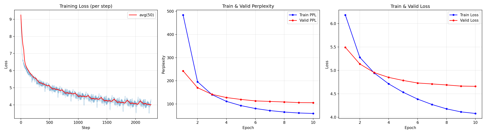

# Part A: Implementing a GPT with Transformer + RoPE

## 1. Overview

In Part A, I implemented a GPT-style autoregressive language model from scratch using PyTorch. The model was trained on the Penn Treebank dataset for next-token prediction. Following the assignment requirements, the implementation manually includes the core components of a modern Transformer decoder: token embeddings, Rotary Positional Embedding (RoPE), causal multi-head self-attention, SwiGLU feed-forward networks, pre-norm residual blocks, and a final linear head for vocabulary prediction.

The model was trained from scratch using cross-entropy loss. I performed a small hyperparameter search over model width, depth, number of attention heads, learning rate, batch size, and dropout. Validation perplexity was used as the main model selection metric.

---

## 2. Dataset and Preprocessing

The dataset used in this part is the Penn Treebank language modeling corpus provided with the assignment. It contains Wall Street Journal text and is split into training and validation files.

The preprocessing follows the starter code structure:

1. Each line is tokenized by whitespace.
2. An `<eos>` token is appended to the end of every line.
3. A vocabulary is built from the training and validation files.
4. Each word is mapped to an integer token id.
5. The token sequence is reshaped into a tensor of shape:

\[
(\text{sequence length}, \text{batch size})
\]

For training, the target sequence is generated by shifting the input sequence by one token. Therefore, the model learns to predict the next token at each position.

If the input batch is:

\[
x_1, x_2, \dots, x_T
\]

then the target is:

\[
x_2, x_3, \dots, x_{T+1}
\]

The optimization objective is the standard next-token cross-entropy loss.

---

## 3. Model Architecture

The implemented model is a decoder-only Transformer language model. Its overall structure is:

```text
Token IDs
   ↓
Token Embedding
   ↓
N × Transformer Decoder Blocks
   ↓
Final LayerNorm
   ↓
Linear Vocabulary Head
   ↓
Next-token logits
```

For the best-performing model, the main architectural hyperparameters were:

| Component | Value |
|---|---:|
| Embedding dimension | 128 |
| Number of Transformer layers | 4 |
| Number of attention heads | 4 |
| Head dimension | 32 |
| Dropout | 0.1 |
| Maximum sequence length | 256 |
| Total parameters | 3,610,880 |

---

## 4. Rotary Positional Embedding

Instead of using absolute positional embeddings, I implemented Rotary Positional Embedding, or RoPE. RoPE injects positional information directly into the query and key vectors before attention scores are computed.

For each attention head, the hidden dimension is divided into pairs. Each pair is interpreted as a two-dimensional vector and rotated by a position-dependent angle. The frequency for dimension pair \(i\) is defined as:

\[
\omega_i = \frac{1}{\theta^{2i/d}}
\]

where \(d\) is the head dimension and \(\theta = 10000\).

For token position \(t\), the rotation angle is:

\[
t \omega_i
\]

In the implementation, I used complex numbers to apply the rotation efficiently. Query and key vectors are reshaped into complex-valued tensors, multiplied by precomputed complex frequencies, and then converted back to real-valued tensors.

This is applied only to the query and key vectors:

\[
Q' = \text{RoPE}(Q), \qquad K' = \text{RoPE}(K)
\]

The value vectors are not rotated.

RoPE is useful because it naturally encodes relative positional information through the inner product between rotated queries and keys.

---

## 5. Causal Multi-Head Self-Attention

The multi-head self-attention module was implemented manually. Given the input hidden states \(X\), the model computes:

\[
Q = XW_Q,\quad K = XW_K,\quad V = XW_V
\]

After applying RoPE to \(Q\) and \(K\), attention scores are computed as:

\[
A = \frac{QK^\top}{\sqrt{d_h}}
\]

where \(d_h\) is the dimension of each attention head.

A causal mask is applied before softmax so that token \(t\) can only attend to positions \(\leq t\). This prevents the model from seeing future tokens during training.

The masked attention is:

\[
\text{Attention}(Q,K,V)
=
\text{softmax}
\left(
\frac{QK^\top}{\sqrt{d_h}} + M
\right)V
\]

where \(M\) contains \(-\infty\) for future-token positions and \(0\) elsewhere.

The outputs of all heads are concatenated and passed through a final output projection.

---

## 6. SwiGLU Feed-Forward Network

Instead of using the standard Transformer feed-forward network with ReLU or GELU, I implemented a SwiGLU feed-forward network.

For an input hidden state \(x\), the SwiGLU FFN computes:

\[
\text{SwiGLU}(x)
=
W_{\text{down}}
\left(
\text{SiLU}(W_{\text{gate}}x)
\odot
W_{\text{up}}x
\right)
\]

where \(\odot\) denotes elementwise multiplication.

In my implementation, the hidden dimension of the FFN is:

\[
4 \times d_{\text{model}}
\]

SwiGLU provides a gated nonlinear transformation and is commonly used in modern language models.

---

## 7. Pre-Norm Residual Transformer Block

Each Transformer block uses pre-normalization. The block structure is:

\[
x = x + \text{Attention}(\text{LayerNorm}(x))
\]

\[
x = x + \text{FFN}(\text{LayerNorm}(x))
\]

This differs from the original post-norm Transformer, where LayerNorm is applied after the residual connection. Pre-norm is generally more stable for training deeper Transformer models.

Each block therefore contains:

1. LayerNorm before attention
2. Causal multi-head self-attention with RoPE
3. Residual connection
4. LayerNorm before FFN
5. SwiGLU FFN
6. Residual connection

---

## 8. Training Setup

The model was trained using next-token prediction with cross-entropy loss.

For a batch of logits \(z\) and target tokens \(y\), the loss is:

\[
\mathcal{L}
=
-\frac{1}{N}
\sum_{i=1}^{N}
\log p(y_i \mid x_{\leq i})
\]

The perplexity is computed from the average cross-entropy loss:

\[
\text{PPL} = \exp(\mathcal{L})
\]

The training setup was:

| Setting | Value |
|---|---:|
| Optimizer | AdamW |
| Weight decay | 0.01 |
| Gradient clipping | 1.0 |
| Learning rate scheduler | CosineAnnealingLR |
| Loss function | CrossEntropyLoss |
| Main metric | Validation perplexity |
| Hardware | RTX 4090 Laptop GPU |

During training, I recorded:

- step-level training loss
- epoch-level training loss
- epoch-level validation loss
- epoch-level training perplexity
- epoch-level validation perplexity

The best model checkpoint was saved whenever validation perplexity improved.

---

## 9. Hyperparameter Search

I tested five configurations. The search varied model size, learning rate, batch size, and dropout.

| Experiment | Embedding Dim | Layers | Heads | Learning Rate | Batch Size | Dropout | Parameters | Best Valid PPL |
|---|---:|---:|---:|---:|---:|---:|---:|---:|
| A | 64 | 2 | 2 | 1e-3 | 16 | 0.1 | 1,411,712 | 125.38 |
| **B** | **128** | **4** | **4** | **1e-3** | **16** | **0.1** | **3,610,880** | **105.64** |
| C | 256 | 4 | 4 | 3e-4 | 16 | 0.1 | 9,318,912 | 109.38 |
| D | 128 | 4 | 4 | 3e-4 | 32 | 0.2 | 3,610,880 | 180.61 |
| E | 256 | 6 | 8 | 1e-4 | 16 | 0.2 | 11,418,112 | 168.97 |

The best-performing configuration was Experiment B:

```text
embedding dimension = 128
number of layers = 4
number of heads = 4
learning rate = 1e-3
batch size = 16
dropout = 0.1
```

It achieved the lowest validation perplexity:

\[
\text{Best Validation PPL} = 105.64
\]

with validation loss:

\[
\text{Best Validation Loss} = 4.6600
\]

---

## 10. Best Run Training Curve

The best hyperparameter configuration was trained for 10 epochs. The training and validation metrics are shown below.

| Epoch | Train Loss | Train PPL | Valid Loss | Valid PPL |
|---:|---:|---:|---:|---:|
| 1 | 6.1827 | 484.30 | 5.4920 | 242.74 |
| 2 | 5.2782 | 196.02 | 5.1373 | 170.26 |
| 3 | 4.9440 | 140.33 | 4.9525 | 141.52 |
| 4 | 4.7119 | 111.26 | 4.8500 | 127.74 |
| 5 | 4.5331 | 93.05 | 4.7849 | 119.68 |
| 6 | 4.3875 | 80.44 | 4.7306 | 113.37 |
| 7 | 4.2711 | 71.60 | 4.7104 | 111.10 |
| 8 | 4.1789 | 65.30 | 4.6891 | 108.76 |
| 9 | 4.1142 | 61.20 | 4.6647 | 106.13 |
| 10 | 4.0808 | 59.20 | 4.6600 | 105.64 |

The training loss decreases steadily throughout training. The validation loss also decreases, indicating that the model learns useful language patterns rather than only memorizing the training data.

The corresponding loss curve figure is saved as:

```text
src/loss_curves_expB.png
```

This figure contains:

1. step-level training loss,
2. training and validation perplexity per epoch,
3. training and validation loss per epoch.



---

## 11. Additional Observation: Longer Training

I also trained the same architecture for 30 epochs. This longer run showed clear overfitting behavior. The validation perplexity reached its best value around epoch 8 and then started to increase, while the training perplexity continued to decrease.

For the 30-epoch run:

| Metric | Value |
|---|---:|
| Best validation perplexity | 111.94 |
| Best epoch | 8 |
| Final training perplexity | 25.47 |
| Final validation perplexity | 135.25 |

This suggests that early stopping would be useful for this dataset and model size. Since the 10-epoch hyperparameter sweep run achieved a better validation perplexity of 105.64, I report Experiment B as the best-performing run.

---

## 12. Analysis

The hyperparameter search shows several trends.

First, increasing the model size from Experiment A to Experiment B significantly improves validation perplexity. Experiment A has only 1.41M parameters and reaches a validation perplexity of 125.38, while Experiment B has 3.61M parameters and reaches 105.64.

Second, simply increasing model size does not always improve performance. Experiment C uses a larger embedding dimension of 256 and has 9.32M parameters, but its validation perplexity is slightly worse than Experiment B. This may be because the learning rate was lower and the model may require different optimization settings or more careful regularization.

Third, the combination of a lower learning rate, larger batch size, and higher dropout in Experiment D performed poorly. Its validation perplexity was 180.61, much worse than Experiment B. This suggests that the model underfit under this setting.

Fourth, Experiment E used the largest architecture, with 6 layers and 8 heads, but also used a low learning rate and higher dropout. It achieved validation perplexity 168.97, which again suggests underfitting or suboptimal optimization.

Overall, the best configuration was a medium-sized model with 4 layers, 4 heads, embedding dimension 128, learning rate 1e-3, and dropout 0.1. This setting balanced model capacity and optimization stability well for the Penn Treebank dataset.

---

## 13. Conclusion

In this part, I implemented a GPT-style Transformer decoder from scratch with RoPE, causal multi-head self-attention, SwiGLU feed-forward networks, pre-norm residual connections, and a final linear language modeling head.

The model was trained on the Penn Treebank dataset using next-token cross-entropy loss. After hyperparameter tuning, the best model achieved:

\[
\boxed{\text{Validation Loss} = 4.6600}
\]

\[
\boxed{\text{Validation Perplexity} = 105.64}
\]

The experiments show that a moderately sized Transformer model can learn meaningful language modeling behavior on Penn Treebank, while larger models require more careful tuning to avoid underfitting or overfitting.
