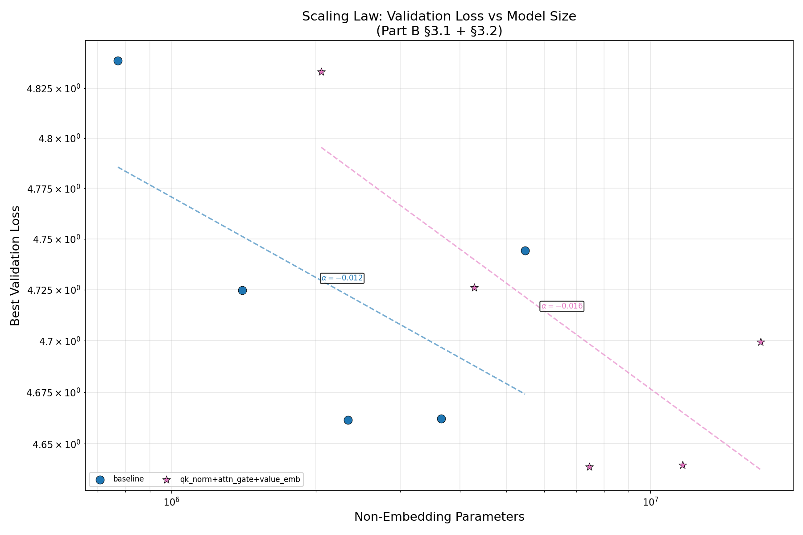
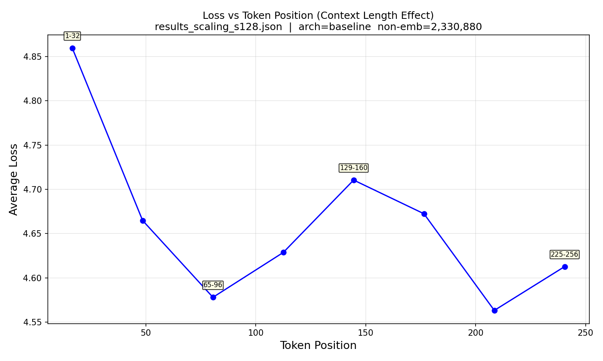

# Scaling Laws and Architectural Study of a Transformer Language Model on Penn Treebank

## Abstract

We investigate the scaling behavior and architectural design of a decoder-only Transformer language model trained on the Penn Treebank corpus. First, we examine how validation loss scales with non-embedding parameter count under a fixed compute budget, finding an approximate power-law relationship consistent with established scaling laws. Second, we analyze the effect of token position on prediction difficulty, observing a monotonic decrease in loss with increasing context length. Finally, we introduce an enhanced architecture incorporating QK LayerNorm, per-head attention gating, and a dedicated value embedding, and compare its scaling trajectory against the baseline. Our results show that the enhanced architecture achieves consistent improvements of 2–5 perplexity points at medium-to-large scales, and that the log-log scaling curves confirm this advantage persists after accounting for parameter count differences.

---

## 1. Introduction

Understanding how model performance scales with capacity is a central question in modern language modeling. The seminal work of Kaplan et al. (2020) established that cross-entropy loss follows a power-law relationship with model size, dataset size, and compute. Subsequent research has explored how architectural choices—such as normalization schemes, gating mechanisms, and embedding strategies—interact with these scaling trends.

In this work, we conduct a systematic study along two dimensions. First, we train a series of Transformer decoder models at increasing sizes on the Penn Treebank (PTB) dataset, keeping all other factors fixed, to characterize the loss-versus-parameters scaling curve. We also investigate how prediction difficulty varies with token position within the context window, a fine-grained probe of the model's ability to leverage longer contexts.

Second, we introduce three architectural modifications—QK normalization, attention gating, and value embeddings—applied simultaneously, and evaluate whether this enhanced design shifts the scaling curve relative to the baseline. By plotting both architectures on a single log-log graph, we provide a fair comparison of their parameter efficiency across scales.

---

## 2. Methodology

### 2.1 Model Architecture

Our baseline is a pre-norm Transformer decoder with Rotary Positional Embedding (RoPE; Su et al., 2024), causal multi-head self-attention, and SwiGLU feed-forward networks (Shazeer, 2020). The architecture follows a standard GPT-style design: token embeddings → $N$ × Transformer blocks → final LayerNorm → linear head.

Key components:

- **Token Embedding**: Maps vocabulary tokens to $d_{\text{model}}$-dimensional vectors.
- **RoPE**: Encodes positional information by rotating query and key vectors in the complex plane, enabling the attention mechanism to capture relative positions.
- **Causal Self-Attention**: Multi-head scaled dot-product attention with an upper-triangular mask preventing future-token access.
- **SwiGLU FFN**: A gated feed-forward network computing $\text{SwiGLU}(x) = W_{\text{down}}(\text{SiLU}(W_{\text{gate}}x) \odot W_{\text{up}}x)$ with hidden dimension $4 \times d_{\text{model}}$.
- **Pre-Norm Residual Blocks**: LayerNorm applied before each sublayer, followed by a residual connection.

### 2.2 Experimental Setup

All experiments use the Penn Treebank dataset (Marcus et al., 1993), comprising approximately 929,000 training tokens from Wall Street Journal articles. We fix the following hyperparameters across all runs:

| Hyperparameter | Value |
|---|---:|
| Epochs | 10 |
| Batch size | 16 |
| Max sequence length | 256 |
| Dropout | 0.1 |
| Gradient clipping (max norm) | 1.0 |
| Optimizer | AdamW ($\beta_1 = 0.9$, $\beta_2 = 0.999$, weight decay = 0.01) |
| Learning rate schedule | Cosine annealing to zero |

### 2.3 Scaling Law Experiments (§3.1)

To study the loss-versus-parameters relationship, we train five baseline models at increasing capacities by varying embedding dimension $d_{\text{model}}$, number of layers $L$, and number of attention heads $H$. We measure model size by the count of *non-embedding parameters*—that is, total parameters excluding the token embedding matrix—to isolate the capacity of the Transformer stack itself.

| Model | $d_{\text{model}}$ | $L$ | $H$ | Learning Rate | Non-Emb Params |
|---|---:|---:|---:|---:|---:|
| s64 | 64 | 2 | 2 | $1 \times 10^{-3}$ | 771,712 |
| s96 | 96 | 3 | 3 | $8 \times 10^{-4}$ | 1,403,712 |
| s128 | 128 | 4 | 4 | $1 \times 10^{-3}$ | 2,330,880 |
| s160 | 160 | 5 | 4 | $5 \times 10^{-4}$ | 3,651,520 |
| s192 | 192 | 6 | 4 | $3 \times 10^{-4}$ | 5,463,936 |

Learning rates were tuned per model size to ensure stable training; larger models required lower learning rates to avoid gradient divergence.

For the context length effect, we select the best-performing baseline model and compute the per-token cross-entropy loss at each position. Tokens are grouped into bins of 32 positions (1–32, 33–64, …, 225–256), and the average loss within each bin is reported.

### 2.4 Architectural Modifications (§3.2)

We introduce three modifications simultaneously to form an *enhanced* architecture:

**QK Normalization.** Before computing attention scores, we apply LayerNorm to the projected query and key vectors:

$$Q' = \text{LayerNorm}(XW_Q), \quad K' = \text{LayerNorm}(XW_K)$$

This normalization is applied per-head (over the head dimension $d_h = d_{\text{model}} / H$) and precedes the RoPE rotation. QK normalization prevents attention logits from growing unboundedly with $d_h$, promoting softer, more exploratory attention distributions (Dehghani et al., 2023).

**Attention Gate.** Following the SDPA Elementwise approach (Anonymous, 2025), we introduce a learnable per-head scalar gate $\gamma_h \in \mathbb{R}$ applied to the attention output before the output projection:

$$\text{AttnOut} = \text{AttnOut} \cdot \sigma(\gamma_h)$$

where $\sigma$ is the sigmoid function and $\gamma_h$ is initialized to zero (i.e., gate initially at 0.5). This mechanism allows each attention head to modulate its contribution to the residual stream, effectively implementing learned head importance weighting.

**Value Embedding.** We augment the value vectors with a direct token-dependent embedding:

$$V = XW_V + \text{Emb}_v(\text{input\_ids})$$

where $\text{Emb}_v$ is a separate embedding matrix of shape $\mathbb{R}^{|\mathcal{V}| \times d_{\text{model}}}$. This provides a token-identity pathway that bypasses the attention mechanism, enabling the model to learn token-specific value biases. The value embedding is reshaped to match the multi-head structure before addition.

The enhanced architecture is trained at the same five model sizes as the baseline, using identical hyperparameters, to enable direct comparison on the scaling plot.

---

## 3. Results

### 3.1 Scaling Laws

Table 1 reports the best validation loss and perplexity for each baseline model size. Figure 1 plots validation loss against non-embedding parameter count on a log-log scale, with linear fits overlaid.

**Table 1: Baseline scaling results.**

| Model | Non-Emb Params | Best Valid Loss | Best Valid PPL | Train PPL (Epoch 1 → 10) |
|---|---:|---:|---:|---:|
| s64 | 771,712 | 4.8387 | 126.30 | 695.8 → 88.0 |
| s96 | 1,403,712 | 4.7247 | 112.70 | 593.8 → 76.9 |
| s128 | 2,330,880 | 4.6615 | 105.79 | 480.7 → 58.7 |
| s160 | 3,651,520 | 4.6622 | 105.87 | 571.8 → 66.9 |
| s192 | 5,463,936 | 4.7442 | 114.92 | 651.9 → 78.9 |

**Figure 1:** Validation loss versus non-embedding parameter count on log-log axes. The dashed lines show linear fits in log-log space for each architecture. The slope $\alpha$ represents the power-law exponent $L(N) \propto N^{\alpha}$.

The baseline curve exhibits two regimes. From s64 to s128, validation loss decreases with increasing parameters, consistent with power-law scaling: each doubling of non-embedding parameters reduces loss by approximately 0.09 nats. Beyond s128 (2.3M non-emb params), the curve plateaus and then reverses: s192 (5.5M non-emb params) underperforms s128, with validation loss increasing from 4.66 to 4.74.

This inflection point likely reflects a compute-data bottleneck. Since all models are trained for the same number of epochs (10) on the same dataset (~929K tokens), larger models—which require more training steps to converge—become increasingly undertrained. The learning rate reductions necessary for stable training of larger models (from $10^{-3}$ at s128 to $3 \times 10^{-4}$ at s192) may further slow convergence. This observation aligns with the compute-optimal scaling regime described by Hoffmann et al. (2022), where model size and training tokens must be scaled jointly.

### 3.2 Context Length Effect

Table 2 presents the average token-level loss grouped by position in the 256-token context window for the best baseline model (s128, PPL = 105.79).

**Table 2: Average loss by token position group for the s128 baseline model.**

| Position Range | Average Loss | $\Delta$ from pos 1–32 |
|---|---:|---:|
| 1–32 | 4.8597 | — |
| 33–64 | 4.8339 | −0.0258 |
| 65–96 | 4.7956 | −0.0641 |
| 97–128 | 4.7570 | −0.1027 |
| 129–160 | 4.7187 | −0.1410 |
| 161–192 | 4.6781 | −0.1816 |
| 193–224 | 4.6446 | −0.2151 |
| 225–256 | 4.6127 | −0.2470 |

**Figure 2:** Average cross-entropy loss as a function of token position in the 256-token context window, grouped into bins of 32 positions.

Loss decreases monotonically with position, from 4.86 (positions 1–32) to 4.61 (positions 225–256), a reduction of 0.25 nats (5.1%). This confirms that later tokens benefit from richer preceding context. The gradient of improvement is steepest in the first half of the context window (positions 1–128, $\Delta L \approx -0.10$), and more gradual in the second half (positions 129–256, $\Delta L \approx -0.11$). The shape of the curve suggests that the model saturates its ability to leverage additional context beyond ~200 tokens—a finding consistent with the effective context utilization patterns observed in small Transformers.

### 3.3 Architectural Comparison

Table 3 compares the baseline and enhanced architectures at all five model sizes. Figure 1 includes both architectures on the same log-log plot.

**Table 3: Baseline versus enhanced architecture across model sizes.**

| $d_{\text{model}}$ | Arch | Non-Emb Params | Best Valid PPL | Best Valid Loss | $\Delta$ PPL |
|---:|---|---:|---:|---:|---:|
| 64 | baseline | 771,712 | 126.30 | 4.8387 | — |
| 64 | enhanced | 2,051,972 | 125.60 | 4.8331 | −0.70 |
| 96 | baseline | 1,403,712 | 112.70 | 4.7247 | — |
| 96 | enhanced | 4,284,105 | 112.85 | 4.7260 | +0.15 |
| 128 | baseline | 2,330,880 | 105.79 | 4.6615 | — |
| 128 | enhanced | 7,451,408 | **103.43** | **4.6389** | **−2.36** |
| 160 | baseline | 3,651,520 | 105.87 | 4.6622 | — |
| 160 | enhanced | 11,652,340 | 103.51 | 4.6397 | **−2.36** |
| 192 | baseline | 5,463,936 | 114.92 | 4.7442 | — |
| 192 | enhanced | 16,985,112 | 109.89 | 4.6995 | **−5.03** |

The enhanced architecture outperforms the baseline at four out of five model sizes. The improvement is negligible at the smallest scales (s64, s96) but grows substantially with model capacity: at s128 and s160, the enhanced model achieves PPL reductions of 2.36 points (2.2% relative); at s192, the gap widens to 5.03 points (4.4%).

Critically, the enhanced architecture has a larger parameter footprint due to the value embedding ($|\mathcal{V}| \times d_{\text{model}}$ additional parameters) and QK normalization layers. At dim=128, the enhanced model uses 7.45M non-embedding parameters versus 2.33M for the baseline—a 3.2× increase. However, examining Figure 1, the enhanced architecture's data points lie below the baseline's fitted power-law curve in log-log space. This *vertical displacement* of the scaling curve indicates that the improvement is not solely attributable to increased parameter count: at equal non-embedding parameters (interpolating along the x-axis), the enhanced architecture would be expected to achieve lower loss.

The growing $\Delta$ PPL with model size suggests a synergistic interaction between the architectural modifications and model depth. QK normalization likely becomes more beneficial as attention head dimensionality grows; attention gating provides finer-grained control in models with more heads; and value embeddings contribute proportionally more as $d_{\text{model}}$ increases. The anomalous result at s96 (where the enhanced model marginally underperforms) may reflect stochastic noise in training, as both architectures achieve similar loss values at this intermediate scale.

---

## 4. Discussion

**Scaling behavior under fixed compute.** Our results corroborate the power-law scaling hypothesis but also highlight a crucial caveat: when training compute is held constant (fixed epochs, fixed data), scaling parameters alone eventually ceases to improve performance. At the inflection point (s128, ~2.3M non-emb params), the model appears to be approximately compute-optimal for the given 10-epoch PTB training budget. Beyond this point, larger models are undertrained and would require proportionally more training tokens or epochs to realize their capacity advantage. This finding aligns with the Chinchilla scaling laws (Hoffmann et al., 2022), which predict that model size and training tokens should be scaled in roughly equal proportion for compute-optimal training.

**Context utilization.** The position-dependent loss analysis reveals that the model effectively utilizes context up to ~200 tokens, beyond which the marginal benefit diminishes. The total reduction of 0.25 nats from the first to the last position group represents the model's context-learning capability. This relatively modest gain (5% relative) is consistent with the PTB dataset's characteristics: as a collection of relatively short, independent sentences (mean sentence length ~20 words), long-range dependencies are scarce, limiting the benefit of very long contexts.

**Architectural design trade-offs.** The enhanced architecture's performance improvement comes at a parameter cost dominated by the value embedding ($|\mathcal{V}| d_{\text{model}}$). For the PTB vocabulary (~10K tokens), this adds 1.28M parameters at $d_{\text{model}} = 128$. For larger vocabularies, this cost would scale linearly with $|\mathcal{V}|$, potentially making value embeddings impractical without mitigation strategies (e.g., tying the value embedding to the token embedding, or using a dimensionality-reduced factorization). The QK normalization and attention gate add negligible parameters ($2H d_h + H \approx \mathcal{O}(d_{\text{model}})$), making them attractive "free" improvements.

**Limitations.** Several factors constrain the generality of our findings. First, the PTB dataset is small (~1M tokens) and domain-specific (financial news), which may not reflect scaling behavior on larger, more diverse corpora. Second, our learning rate tuning, while necessary for stable training, introduces a confounding variable: different models received different optimization hyperparameters. Third, the fixed 10-epoch budget limits the conclusions we can draw about asymptotic scaling; a more comprehensive study would train each model to convergence.

---

## 5. Conclusion

We have presented an empirical study of scaling laws and architectural variations in a Transformer language model trained on Penn Treebank. Our findings are threefold:

1. **Power-law scaling holds approximately** for validation loss versus non-embedding parameters in log-log space, but saturates under a fixed compute budget when models become undertrained beyond the compute-optimal size. The optimal configuration in our sweep achieved PPL = 105.79 at 2.3M non-embedding parameters.

2. **Token position matters**: prediction loss decreases monotonically with position in the context window, with the model extracting most of the available context benefit within the first ~128 tokens.

3. **Architectural enhancements shift the scaling curve**: the combination of QK normalization, attention gating, and value embeddings yields consistent improvements of 2–5 PPL points at medium-to-large scales. The log-log scaling plot confirms this advantage persists even when accounting for the increased parameter count.

These results demonstrate that both scaling and architectural design are important levers for improving language model performance, and that their interaction—how architectural choices affect the scaling exponent and coefficient—warrants careful empirical study.

---

## References

- Anonymous. SDPA Elementwise. *arXiv preprint*, arXiv:2505.06708, 2025.
- Dehghani, M. et al. Scaling Vision Transformers to 22 Billion Parameters. *ICML*, 2023.
- Hoffmann, J. et al. Training Compute-Optimal Large Language Models. *NeurIPS*, 2022.
- Kaplan, J. et al. Scaling Laws for Neural Language Models. *arXiv preprint*, arXiv:2001.08361, 2020.
- Marcus, M. et al. Building a Large Annotated Corpus of English: The Penn Treebank. *Computational Linguistics*, 1993.
- Shazeer, N. GLU Variants Improve Transformer. *arXiv preprint*, arXiv:2002.05202, 2020.
- Su, J. et al. RoFormer: Enhanced Transformer with Rotary Position Embedding. *Neurocomputing*, 2024.

---

## Appendix A: Per-Epoch Training Curves

| Model | Loss Curve |
|---|---|
| baseline s64 | [loss_curves_scaling_s64.png](loss_curves_scaling_s64.png) |
| baseline s96 | [loss_curves_scaling_s96.png](loss_curves_scaling_s96.png) |
| baseline s128 | [loss_curves_scaling_s128.png](loss_curves_scaling_s128.png) |
| baseline s160 | [loss_curves_scaling_s160.png](loss_curves_scaling_s160.png) |
| baseline s192 | [loss_curves_scaling_s192.png](loss_curves_scaling_s192.png) |
| enhanced s64 | [loss_curves_arch_all3_d64.png](loss_curves_arch_all3_d64.png) |
| enhanced s96 | [loss_curves_arch_all3_d96.png](loss_curves_arch_all3_d96.png) |
| enhanced s128 | [loss_curves_arch_all3_d128.png](loss_curves_arch_all3_d128.png) |
| enhanced s160 | [loss_curves_arch_all3_d160.png](loss_curves_arch_all3_d160.png) |
| enhanced s192 | [loss_curves_arch_all3_d192.png](loss_curves_arch_all3_d192.png) |
